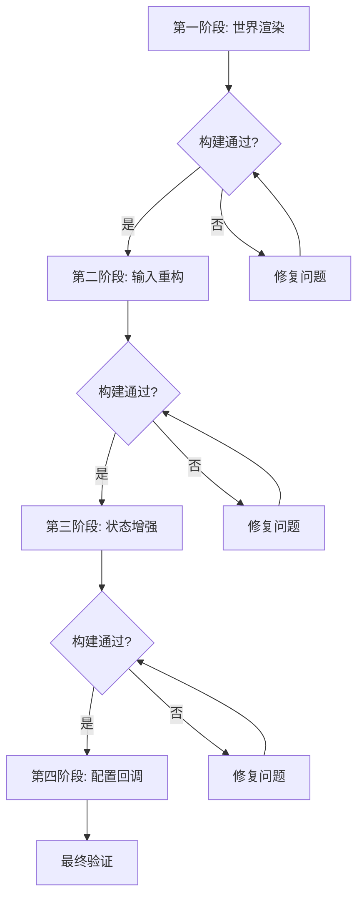

# Survey 模式对标 Litematica 实施计划

## 项目研究结论

### 当前状态
- **Survey 模式完成度**: 约 30%
- **核心差距**: 缺少世界内渲染（15%完成度）、输入处理架构不规范（25%完成度）
- **代码现状**: SurveySession.java 有基础状态管理，SurveyHud.java 仅有 HUD 文本渲染，输入通过 GLFW 原生 API + Mixin

### 参考目标（Litematica）
- **渲染架构**: 分层渲染（世界渲染层 + HUD 覆盖层），OverlayRenderer 统一管理
- **输入架构**: HotkeyProvider 分类管理 + HotkeyCallback 统一回调 + ActionResult 返回值
- **状态管理**: DataManager 作为状态中心，统一管理工具模式、选择状态、放置管理器

### 约束条件
- 目标 MC 版本: 1.20.1 (Java 17), 26.1.1 (Java 25), 26.2 (Java 25)
- 构建流程: `./gradlew spotlessApply && ./gradlew clean buildAndGather`
- 提交规范: `feat(survey): description` 或 `fix(survey): description`
- 跨版本兼容: Fabric Rendering API 在 1.20.1 使用 `WorldRenderEvents`，26.x 使用 `RenderLayerEvents`

---

## 实施计划（分阶段）

### 第一阶段：世界内渲染系统（P0 - 最低风险，最高用户价值）

#### 目标
创建 `SurveyRenderer.java`，实现世界内节点轮廓、路径连线、悬停高亮渲染。

#### 新建文件
1. **`src/main/java/com/ecjkim/wayfarer/client/render/SurveyRenderer.java`**
   - 注册到 Fabric 渲染事件（`WorldRenderEvents.AFTER_TRANSLUCENT`）
   - `renderNodeOutlines()`: 渲染所有节点的方块轮廓
   - `renderPathConnections()`: 录制中节点之间的连线
   - `renderHoverHighlight()`: 悬停节点时高亮显示
   - `renderNodeInfo()`: 悬停时显示节点信息（坐标、类型）

#### 修改文件
2. **`src/main/java/com/ecjkim/wayfarer/client/WayfarerClient.java`**
   - 添加 `SurveyRenderer.register()` 调用

3. **`src/main/java/com/ecjkim/wayfarer/client/render/SurveyHud.java`**
   - 增强 HUD 显示（当前模式指示器、快捷键提示）

#### 技术细节
- 使用 `BlockPos` 和 `BakedQuad` 进行方块轮廓渲染
- 使用 `VertexConsumer` 进行连线渲染
- 颜色方案：起点(绿色)、航点(蓝色)、终点(红色)、悬停(黄色)
- 每帧从 `RoadNetworkDatabase` 获取最新节点数据

---

### 第二阶段：输入处理系统重构（P0 - 中等风险，核心改进）

#### 目标
规范化热键处理架构，添加 Survey 专用热键。

#### 新建文件
4. **`src/main/java/com/ecjkim/wayfarer/client/config/SurveyHotkeys.java`**
   - `START_RECORDING`: 开始录制热键
   - `STOP_RECORDING`: 结束录制热键
   - `CYCLE_CORNER_TYPE`: 切换角落类型热键
   - `CANCEL_RECORDING`: 取消录制热键
   - `TOGGLE_RENDERING`: 切换渲染显示热键

5. **`src/main/java/com/ecjkim/wayfarer/client/config/HotkeyCallbackSurvey.java`**
   - 实现 `HotkeyCallback` 接口
   - `onKeyAction(KeyAction action, KeyBind key)` 返回 `ActionResult`

#### 修改文件
6. **`src/main/java/com/ecjkim/wayfarer/client/WayfarerClient.java`**
   - 替换现有 GLFW 原生 API 检测为 malilib `KeyBind` 回调
   - 保留 `consumeHotkey()` 作为降级方案

7. **`src/main/java/com/ecjkim/wayfarer/client/mixin/MouseScrollMixin.java`**
   - 重构为使用 `SurveyHotkeys.CYCLE_CORNER_TYPE` 的回调

8. **`src/main/java/com/ecjkim/wayfarer/client/WayfarerHotkeys.java`**
   - 添加 Survey 相关热键引用

#### 技术细节
- 使用 malilib 的 `ConfigHotkey` + `KeyBind` + `HotkeyCallback` 体系
- `ActionResult.SUCCESS`: 热键已处理，防止事件继续传播
- `ActionResult.FAIL`: 热键未处理，允许其他处理器响应
- 热键分类: "Survey" 类别

---

### 第三阶段：Survey 状态管理增强（P1 - 中等风险，提升体验）

#### 目标
扩展 SurveySession 状态机，添加预览模式和节点交互功能。

#### 修改文件
9. **`src/main/java/com/ecjkim/wayfarer/client/road/record/SurveySession.java`**
   - State 扩展: `IDLE`, `RECORDING`, `PREVIEW`
   - 添加 `enterPreviewMode()`: 进入预览模式
   - 添加 `exitPreviewMode()`: 退出预览模式
   - 添加 `toggleNodeSelection(UUID nodeId)`: 节点选择/取消
   - 添加 `removeSelectedNodes()`: 移除选中节点

10. **`src/main/java/com/ecjkim/wayfarer/client/render/SurveyHud.java`**
    - PREVIEW 状态 HUD 显示
    - 选中节点计数显示
    - 剩余距离估算

#### 技术细节
- PREVIEW 模式: 显示所有节点位置和路径，但不可编辑
- 节点选中: 高亮显示选中的节点
- 移除操作: 从 nodeIds 中移除选中节点

---

### 第四阶段：配置回调机制（P2 - 低风险，锦上添花）

#### 目标
实现配置变更自动通知，无需手动 reload。

#### 修改文件
11. **`src/main/java/com/ecjkim/wayfarer/client/ToolItemManager.java`**
    - 添加 `addChangeListener(ChangeListener)` 方法
    - 修改 `setToolItem()` 触发监听

12. **`src/main/java/com/ecjkim/wayfarer/client/config/WayfarerConfig.java`**
    - 在 `setToolItem()` 中添加变更回调

#### 技术细节
- 使用 `Consumer<String>` 作为回调接口
- 配置变更时自动调用所有监听器

---

## 风险处理

| 风险点 | 影响 | 缓解措施 |
|--------|------|---------|
| Fabric 渲染 API 跨版本差异 | 渲染逻辑在不同 MC 版本不兼容 | 使用 `versions/<ver>/src/` 覆盖层，1.20.1 用 `WorldRenderEvents`，26.x 用 `RenderLayerEvents` |
| malilib API 版本兼容性 | 可能缺少某些 API | 先验证可用 API，必要时降级实现 |
| 现有功能回归 | 修改输入系统可能破坏现有热键 | 保留旧的 GLFW 检测作为降级方案 |
| 并发状态问题 | 渲染线程读取时状态正在变更 | 使用不可变快照或 volatile 字段 |

---

## 执行顺序

---

## 验证标准

每个阶段完成后必须通过:
1. `./gradlew spotlessApply` — 代码格式检查
2. `./gradlew clean buildAndGather` — 三个版本编译通过
3. 手动验证:
   - Survey 模式正常进入/退出
   - 节点轮廓正确渲染
   - 热键正确响应
   - 录制流程完整（开始→添加节点→结束→保存）

---

## 代码参考

当前关键文件:
- [SurveySession.java](file:///Users/cjkim/Documents/MinecraftNavigationAndMapMod/src/main/java/com/ecjkim/wayfarer/client/road/record/SurveySession.java)
- [SurveyHud.java](file:///Users/cjkim/Documents/MinecraftNavigationAndMapMod/src/main/java/com/ecjkim/wayfarer/client/render/SurveyHud.java)
- [ToolItemManager.java](file:///Users/cjkim/Documents/MinecraftNavigationAndMapMod/src/main/java/com/ecjkim/wayfarer/client/ToolItemManager.java)
- [WayfarerClient.java](file:///Users/cjkim/Documents/MinecraftNavigationAndMapMod/src/main/java/com/ecjkim/wayfarer/client/WayfarerClient.java)
- [WayfarerHotkeys.java](file:///Users/cjkim/Documents/MinecraftNavigationAndMapMod/src/main/java/com/ecjkim/wayfarer/client/config/WayfarerHotkeys.java)

参考实现 (Litematica):
- [ToolMode.java](file:///Users/cjkim/github_pro/litematica/src/main/java/litematica/tool/ToolMode.java)
- [ToolModeData.java](file:///Users/cjkim/github_pro/litematica/src/main/java/litematica/tool/ToolModeData.java)
- [OverlayRenderer.java](file:///Users/cjkim/github_pro/litematica/src/main/java/litematica/render/OverlayRenderer.java)
- [RenderHandler.java](file:///Users/cjkim/github_pro/litematica/src/main/java/litematica/event/RenderHandler.java)
- [HotkeyCallbacks.java](file:///Users/cjkim/github_pro/litematica/src/main/java/litematica/config/HotkeyCallbacks.java)
- [HotkeyCallbackToolActions.java](file:///Users/cjkim/github_pro/litematica/src/main/java/litematica/config/HotkeyCallbackToolActions.java)
- [LitematicaHotkeyProvider.java](file:///Users/cjkim/github_pro/litematica/src/main/java/litematica/input/LitematicaHotkeyProvider.java)
