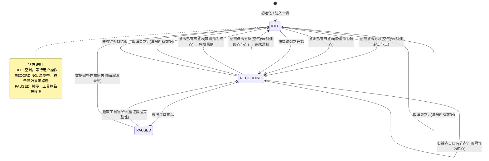
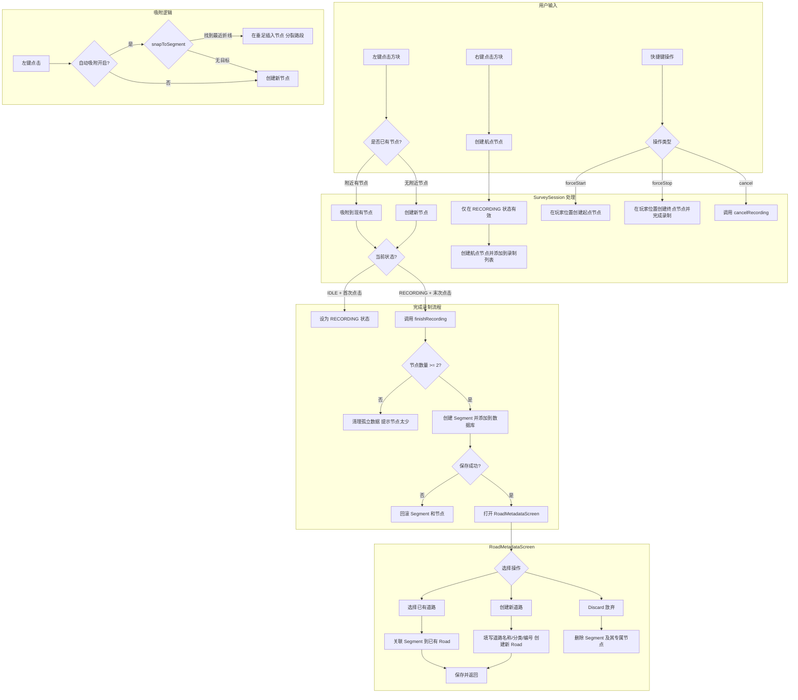
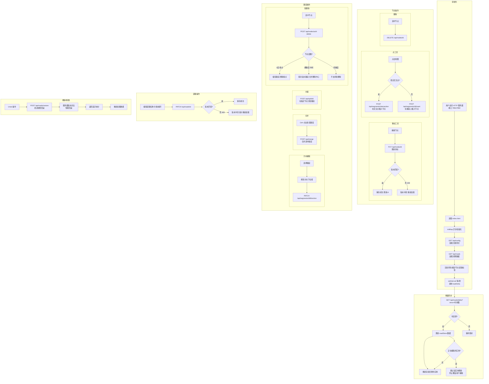
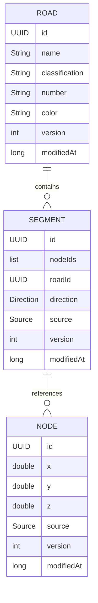
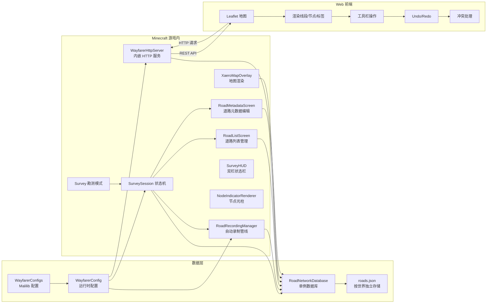

# Wayfarer 业务逻辑流程图

本文档整理了 Wayfarer 模组的完整业务逻辑，包括用户交互、数据流向、版本差异等。

---

## 一、Survey 勘测录制流程

---

## 二、Web 编辑器与 API 流程

---

## 三、数据生命周期流程

```mermaid
flowchart TD
    subgraph 持久化
        A[操作触发] --> B{数据库状态变更?}
        B -->|是| C[markDirty 设置脏标志]
        C --> D[saveToDisk\n序列化到 JSON]
        D --> E[写入 wayfarer/worldKey/roads.json]
        B -->|否| F[无操作]
    end

    subgraph 世界切换
        G[玩家切换世界] --> H[setWorldKey]
        H --> I{当前数据 dirty?}
        I -->|是| J[自动保存当前世界数据]
        I -->|否| K[跳过保存]
        J --> L[切换到新世界 key]
        K --> L
        L --> M[创建新目录结构]
        M --> N[loadFromDisk\n加载新世界数据]
        N --> O[autoGraphify\n自动图化处理]
    end

    subgraph 自动处理管线
        P[CRUD 操作后] --> Q[maybeCleanupOrphans]
        Q --> R{孤立节点清理开启?}
        R -->|是| S[删除无引用的节点]
        R -->|否| T[跳过]
        P --> U[maybeGraphify]
        U --> V{自动图化开启?}
        V -->|是| W[graphify]
        W --> X[对度数大于2的非端点节点\n分裂路段使其成为端点]
        V -->|否| Y[跳过]
    end

    subgraph 版本控制
        Z[实体操作] --> Z1[递增 version 计数器]
        Z1 --> Z2[更新 modifiedAt 时间戳]
        Z2 --> Z3[Web 编辑器发送请求\n携带 expectedVersion]
        Z3 --> Z4{版本匹配?}
        Z4 -->|是| Z5[执行操作]
        Z4 -->|否| Z6[返回 409 Conflict\n提示重新加载]
    end

    subgraph 冲突解决
        AA[Web 端收到 409] --> AB[显示冲突提示]
        AB --> AC[接受游戏版本\n使用服务器数据覆盖]
        AB --> AD[重试\n重新获取最新版本号]
        AC --> AE[重新加载数据]
        AD --> AE
    end
```

---

## 四、数据模型关系

---

## 五、系统架构

---

## 六、版本差异对比

| 功能模块 | mainProject (最新版) | versions/26.2 | versions/26.1.1 | versions/1.20.1 |
|---------|---------------------|---------------|-----------------|-----------------|
| **SurveySession 状态机** | ✓ 完整实现 | ✗ | ✗ | ✗ |
| **RoadRecordingManager** | ✓ 完整实现 | ✓ 部分实现 | ✓ 部分实现 | ✗ |
| **RoadListScreen** | ✓ 三栏布局+拖拽+横向滚动 | ✓ 基础版 | ✗ | ✗ |
| **RoadMetadataScreen** | ✓ CREATE/EDIT 双模式 | ✓ 基础版 | ✗ | ✗ |
| **HTTP 服务器** | ✓ 完整实现 | ✗ | ✗ | ✗ |
| **Web 前端编辑器** | ✓ Leaflet 全功能 | ✗ | ✗ | ✗ |
| **Delta 增量同步** | ✓ 每秒更新 | ✗ | ✗ | ✗ |
| **版本冲突检测** | ✓ 409 响应+解决 | ✗ | ✗ | ✗ |
| **Soft Delete** | ✓ 度数感知软删除 | ✗ | ✗ | ✗ |
| **Graphify 自动图化** | ✓ 分裂非端点节点 | ✗ | ✗ | ✗ |
| **自动吸附** | ✓ 节点+折线吸附 | 部分 | 部分 | ✗ |
| **方向系统** | ✓ 三种方向+下拉选择 | 部分 | ✗ | ✗ |
| **道路分类样式** | ✓ G/S/X/Y/C 可配置 | ✗ | ✗ | ✗ |
| **Xaero 地图渲染** | ✓ 分类颜色/线宽 | ✓ 基础版 | ✓ 基础版 | ✗ |
| **分类徽章** | ✓ 彩色/白色双样式 | ✗ | ✗ | ✗ |
| **Undo/Redo** | ✓ 基于快照回滚 | ✗ | ✗ | ✗ |
| **多世界存储** | ✓ 按世界独立 JSON | ✗ | ✗ | ✗ |
| **配置系统** | ✓ Malilib 集成 | ✓ 基础版 | ✗ | ✗ |
| **节点指示光柱** | ✓ 可配置 | ✓ 基础版 | ✗ | ✗ |

---

## 七、配置项说明

| 配置项 | 类型 | 默认值 | 说明 |
|-------|------|--------|------|
| autoIntegral | Boolean | true | 坐标自动取整到整数 |
| autoSnapEndpoints | Boolean | true | 自动吸附首尾端点 |
| rdpEpsilon | Double | 1.0 | RDP 简化容差（格数） |
| autoDeleteOrphanNodes | Boolean | true | 自动删除孤立节点 |
| autoGraphify | Boolean | true | 自动图化路段网络 |
| webMaxZoom | Integer | 10 | 网页地图最大缩放等级 |
| toolItem | String | minecraft:wheat_seeds | Survey 工具物品 |
| showKeyHints | Boolean | true | 按键提示开关 |
| gColor / gWidth | String / Double | FFC000 / 6.0 | 国道颜色和线宽 |
| sColor / sWidth | String / Double | FFD700 / 4.5 | 省道颜色和线宽 |
| xColor / xWidth | String / Double | FFFFFF / 3.5 | 乡道颜色和线宽 |
| yColor / yWidth | String / Double | FFFFFF / 3.0 | 县道颜色和线宽 |
| cColor / cWidth | String / Double | 888888 / 3.0 | 村道颜色和线宽 |
